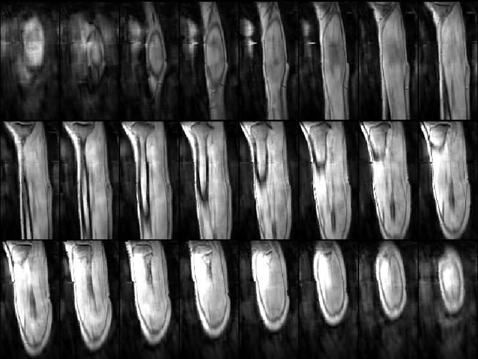
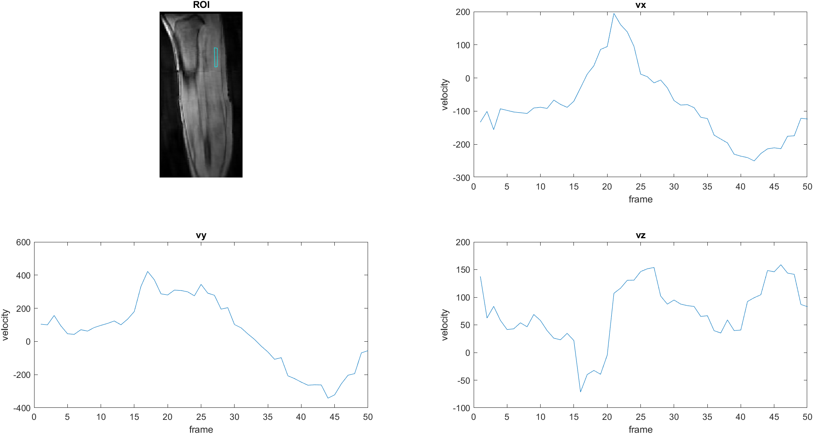

[Home](https://bcunnane.github.io/)  
[View Code](https://github.com/bcunnane/CS_4D_flow)

### Background

Most of my data is collected at UC San Diego's Radiology Imaging Laboratory on a 1.5T GE scanner. This allows for equipment and software developed in the past to be easily used again for new experiments. A 3T Siemens scanner is available at SDSU, but using it means porting our old equipment to the new system and learning to work with different MR sequences. In this case, we were interested in using the Siemens compressed sensing (CS) 4D flow sequence to collect velocity encoded phase contrast (VEPC) data of the leg. I aided in setting up our test equipment at the SDSU scanner, and developed a DICOM processing MATLAB script for managing data collected with the Siemens sequence. 

### DICOM processing

The processing steps are:

1. Import DICOM phase data as single matrix where each 'slice' of the volume is an image frame.
2. If imported images are unsigned, perform linear rescaling using RescaleSlope and RescaleIntercept values in DICOM header info.
3. Repeat for each velocity direction x,y, and z. Use the DICOM header info to assign velocity direction ('Through' = vz, 'ap' = vx, 'fh' = vy).
4. Import the combined magnitude DICOM data as magnitude, m.
5. Read the header info of each DICOM to get slice locations. Determine where the slice locations repeat, indicating a new frame.

### Testing

Velocity data collected from the Siemens sequence was evaluated using the following steps. The example below uses the 21092116RH dataset collected at SDSU, which has 24 slices and 50 frames. 

1. Display a montage of all frame 1 slices in the magnitude data. Select a "slice of interest" in the magnitude data on which to draw the region of interest (ROI).
2. Draw the ROI on medial gastrocnemius (MG) muscle and transform into a mask.
3. Select all frames corresponding to the slice of interest in the velocity data. Use the mask to select data within the ROI for these slices. 
4. Calculate average velocity in the ROI for each frame and plot the results.
5. Repeat for each velocity direction x, y, and z.

> Montage of frame 1 of all slices. Used to select slice with clearest view of MG muscle. 

> Velocity plots for ROI on MG muscle
